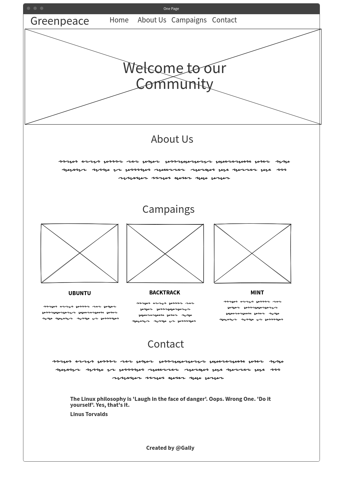

# ONE PAGE Excercice HTML/CSS

###### Meilyn ANDRADE (Junior Web Developper At Becode.- ADA Lovelace-2 promotion # 5)

Réaliser un minisite d'une page (= un one-pager) présentant une association caritative au choix.

## Association Caritative 

**Greenpeace** (littéralement « paix verte ») est une ONGI de protection de l'environnement présente dans plus de 55 pays à travers le monde,luttant contre ce qu'il estime être les plus grandes menaces pour l'environnement et la biodiversité sur la planète.

## Maquetage

